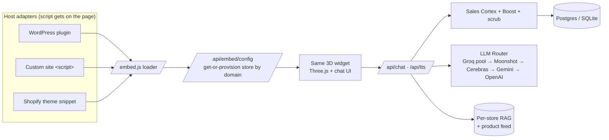

# Mark — the World's First Digital Salesman

Mark is a **3D robot sales agent** you drop onto any website with **one line of code**. He greets visitors, learns your catalog, answers questions from *your* site (no hallucinating), talks with voice, and closes like a trained salesperson — for **e-commerce, real estate, automobiles, and services**.

- **Frontend:** a floating 3D widget (Three.js) — installs via a WordPress plugin, a single `<script>` tag on any site, or a Shopify theme snippet.
- **Backend:** a multi-tenant FastAPI service that provisions each store by domain, crawls its catalog, and runs the sales brain + voice.
- **One core, thin adapters:** WordPress, custom sites, and Shopify all inject the *same* widget from the *same* backend. See [`EMBED_ARCHITECTURE.md`](EMBED_ARCHITECTURE.md).

> **License:** GPL-2.0-or-later. **Live backend:** `https://mark-udfz.onrender.com`

---

## Table of contents

1. [What Mark does](#what-mark-does)
2. [Architecture](#architecture)
3. [Repo layout](#repo-layout)
4. [Quick start — backend](#quick-start--backend)
5. [Environment variables](#environment-variables)
6. [Get an LLM key (free)](#get-an-llm-key-free)
7. [Install the widget](#install-the-widget) (WordPress · custom site · Shopify)
8. [Plans, quotas & billing](#plans-quotas--billing)
9. [The sales brain & evals](#the-sales-brain--evals)
10. [Observability](#observability)
11. [Staging, CI & kill-switches](#staging-ci--kill-switches)
12. [Contributing](#contributing)

---

## What Mark does

| Capability | How |
|---|---|
| **Grounded answers** | Per-store RAG crawl of the site + product feed. Mark answers from *your* content; a scrub layer never lets him invent prices, stock, discounts, or guarantees. |
| **Real salesmanship** | A stage machine (greet → discover → present → objection → close) with personas + objection handling, plus a compact Hormozi/Elliott "closer" directive. |
| **Voice** | Free Edge TTS out of the box; optional premium OpenAI / Cartesia voices on paid plans. |
| **Multi-tenant & turnkey** | Stores are auto-provisioned by domain. No per-store API key — one shared backend key, protected by a per-store monthly quota (cost firewall). |
| **Self-learning** | An off-request-path engine distills winning *strategy* (never raw PII) from real conversations into each store's playbook. |
| **Multi-niche** | E-commerce, real estate, automobile, services — same core, catalog adapters per platform. |

---

## Architecture



The **only** per-host differences are *how the script tag lands on the page* and *where the catalog comes from*. Everything else is shared — one place to fix bugs and ship features.

---

## Repo layout

```
backend/                    FastAPI service (the brains)
  main.py                   API: chat, TTS, embed, billing, ops, admin mount
  llm_router.py             Multi-provider fallback + per-key circuit breaker
  rag_engine.py             Per-store crawl + retrieval (grounding)
  sales_cortex.py           Stage machine, personas, objection handling
  sales_boost.py            Compact closer directive + fabricated-offer scrub
  learning_engine.py        MAIE — off-path strategy learning per store
  billing.py                Stripe checkout + webhook → plan mapping
  database.py               Postgres/SQLite, migrations, usage counters
  config.py                 Env-driven settings
  knowledge/                Sales doctrine corpus (compiled into the brain)
  evals/                    Offline + live sales-quality gates
mark-ai-chatbot/            WordPress plugin (the 3D widget + admin SPA)
.github/workflows/ci.yml    Compile + eval gate on every push
render.yaml                 Render Blueprint (prod + staging, IaC)
EMBED_ARCHITECTURE.md       One-core / thin-adapters design
STAGING.md                  Safe-ship flow, rollback, kill-switches
```

---

## Quick start — backend

**Prereqs:** Python 3.11+, one LLM key ([free — see below](#get-an-llm-key-free)).

```bash
git clone https://github.com/muhammadroohullah110/mark.git
cd mark/backend
python -m venv .venv && source .venv/bin/activate   # Windows: .venv\Scripts\activate
pip install -r requirements.txt
cp .env.example .env        # then edit .env — at minimum set GROQ_API_KEY
uvicorn main:app --host 0.0.0.0 --port 8000
```

Open `http://localhost:8000/api/health` → should report healthy. With no `DATABASE_URL`, it uses a local SQLite file (zero-config dev). Set `DATABASE_URL` to a Postgres URL for production.

### Deploy to Render (one click)

Use the included [`render.yaml`](render.yaml) Blueprint: **Render Dashboard → New → Blueprint → point at your fork**. It provisions the prod service (+ an isolated staging service and DB). Set the secret env vars in the dashboard. Health check path: `/api/health`.

Manual alternative: New Web Service → root `backend`, build `pip install -r requirements.txt`, start `uvicorn main:app --host 0.0.0.0 --port $PORT`.

---

## Environment variables

Copy `backend/.env.example` and fill it in. **Only one variable is required to boot** (`GROQ_API_KEY`); everything else has safe defaults.

### Core

| Var | Required | Default | Purpose |
|---|---|---|---|
| `GROQ_API_KEY` | ✅ | — | Main LLM key ([free](#get-an-llm-key-free)). |
| `DATABASE_URL` | prod | SQLite file | Postgres connection string. |
| `ALLOWED_ORIGINS` | prod | `*` (creds off) | Comma-separated allowlist to lock the **admin** API to your dashboard domain. Public widget routes stay open regardless. |
| `BACKEND_PUBLIC_URL` | — | live URL | Base URL used in generated embed snippets. |

### LLM fallback chain (all optional — add as many as you like)

| Var | Purpose |
|---|---|
| `GROQ_API_KEYS` | Comma-separated **pool** of Groq keys (spreads the free rate limit). |
| `MOONSHOT_API_KEY` | Kimi K2 direct fallback. |
| `CEREBRAS_API_KEY` · `GEMINI_API_KEY` · `OPENAI_API_KEY` | Further fallbacks, tried in order. |
| `GROQ_MODEL` · `MOONSHOT_MODEL` · `FALLBACK_LLM_MODEL` | Model-id overrides. |

### Voice (optional — free Edge TTS works with none of these)

`PREMIUM_TTS` · `PREMIUM_TTS_MODEL` · `PREMIUM_TTS_VOICE` · `PREMIUM_TTS_INSTRUCTIONS` (OpenAI) · `CARTESIA_API_KEY` · `CARTESIA_MODEL` · `CARTESIA_VOICE`.

### Cost firewall & quotas

`FREE_MONTHLY_QUOTA` (500) · `STARTER_MONTHLY_QUOTA` (2000) · `PRO_MONTHLY_QUOTA` (10000) · `BUSINESS_MONTHLY_QUOTA` (0 = unlimited) · `GLOBAL_MONTHLY_CAP` (0 = off) · `STORE_RATE_PER_MIN` (120) · `COST_PER_CHAT_USD` (0.001, for the dashboard).

### Billing (Stripe) & ops

`STRIPE_SECRET_KEY` · `STRIPE_PRICE_TIERS` (JSON `{price_id: plan}`) · `STRIPE_PRICE_ID` (legacy single price → premium) · `STRIPE_WEBHOOK_SECRET` · `BILLING_SUCCESS_URL` · `BILLING_CANCEL_URL` · `OPS_METRICS_KEY` (unlocks `/api/ops/metrics`).

### Kill-switches & misc

`SALES_CORTEX=0` · `SALES_BOOST=0` (disable brain layers without a deploy) · `WP_SHARED_SECRET` (auth for WP-triggered crawls) · `ENABLE_LOGGING` · `MAX_CRAWL_PAGES` · rate limits (`RATE_CHAT`, `RATE_TTS`, …).

---

## Get an LLM key (free)

Mark runs great on **Groq's free tier** (Kimi K2).

1. Sign up at [console.groq.com](https://console.groq.com) → **API Keys** → create a key.
2. Put it in `.env` as `GROQ_API_KEY=...` (or set it in Render).
3. **Scaling tip:** the free tier is rate-limited *per key*. Create several keys and set `GROQ_API_KEYS=key1,key2,key3` to pool them; add a card for Groq's Developer tier for ~10× limits. Per-chat cost is a fraction of a cent.

No Groq? The router also speaks Moonshot, Cerebras, Gemini, and OpenAI — set any of their keys instead.

---

## Install the widget

### WordPress (easiest)

1. Build the plugin zip (or grab a release): the repo ships the plugin source in `mark-ai-chatbot/`.
2. WP Admin → **Plugins → Add New → Upload Plugin** → the `mark-ai-chatbot-x.y.z.zip` → **Activate**.
3. Open the **Mark** admin page → finish the 1-step setup (it auto-registers your store with the backend and crawls your catalog).

### Any website (one line)

```html
<script src="https://mark-udfz.onrender.com/embed.js" data-site="yourstore.com" async></script>
```

Paste it before `</body>`. Mark provisions the store by domain on first load, crawls the site, and appears. No plugin, no key. (Point `src` at your own backend if self-hosting.)

### Shopify (works today, no OAuth)

Shopify exposes a public, keyless catalog at `/products.json`, so no app install is needed for the catalog:

**Online Store → Themes → Edit code → `theme.liquid`**, paste before `</body>`:

```html
<script src="https://mark-udfz.onrender.com/embed.js" data-site="{{ shop.permanent_domain }}" async></script>
```

Full detail and the (optional) Partner-app upgrade path: [`EMBED_ARCHITECTURE.md`](EMBED_ARCHITECTURE.md).

---

## Plans, quotas & billing

One `plan` field per store drives **both** the monthly chat quota **and** premium voice:

| Plan | Monthly chats | Premium voice |
|---|---|---|
| `free` | 500 | — |
| `starter` | 2,000 | ✅ |
| `pro` | 10,000 | ✅ |
| `business` / `premium` | unlimited | ✅ |

Stores **never self-upgrade** — the plan flips only on a Stripe-signed webhook (the webhook is fail-closed: no `STRIPE_WEBHOOK_SECRET`, no plan changes).

**Enable self-serve upgrades:**
1. Create a Stripe subscription **Price** for each paid tier.
2. Map them: `STRIPE_PRICE_TIERS={"price_abc":"starter","price_def":"pro","price_ghi":"business"}`.
3. Set `STRIPE_SECRET_KEY` + `STRIPE_WEBHOOK_SECRET`, and point a Stripe webhook at `POST /api/billing/webhook`.

The target plan rides in checkout metadata, so upgrades apply exactly — no price-guessing.

---

## The sales brain & evals

- **Cortex** (`sales_cortex.py`) — stages, personas, and LAER objection handling, compiled from the doctrine corpus in `backend/knowledge/`.
- **Boost** (`sales_boost.py`) — a ~130-token closer directive **plus** `scrub()`, a precise safety net that neutralizes any coupon code / %-off Mark isn't authorized to give (owner-configured offers pass through untouched). The scrub also runs *buffered* during streaming, so a fabricated offer never reaches the screen even mid-token.

**Run the gates:**

```bash
# Offline regression gate (no keys needed) — this also gates CI
python backend/evals/run_cortex_eval.py

# Live behavior check against a running store
BACKEND=https://your-backend STORE_ID=<id> python backend/evals/run_certification.py

# Full LLM-judge sales-quality score (/100, promote at ≥90)
BACKEND=https://your-backend STORE_ID=<id> JUDGE_API_KEY=<key> \
  python backend/evals/run_quality_eval.py
```

---

## Observability

With `OPS_METRICS_KEY` set, a platform-owner fleet snapshot is available (disabled/404 when the key is unset):

```bash
curl -H "X-Ops-Key: $OPS_METRICS_KEY" https://your-backend/api/ops/metrics
```

Returns per-store plan, monthly usage, quota %, over-quota flag, and rough cost — plus fleet totals and the global-cap status. It reads the **same** counters the cost firewall enforces, so the numbers match what actually throttles chats.

---

## Staging, CI & kill-switches

One backend serves all stores, so a bad deploy has blast radius. The repo ships guardrails:

- **CI** (`.github/workflows/ci.yml`) — compiles all Python/JS/PHP and runs the offline sales-brain eval on every push/PR.
- **Staging** — `render.yaml` declares an isolated staging service + DB (own branch, test keys). Full flow, smoke tests, and rollback in [`STAGING.md`](STAGING.md).
- **Instant mitigation without a deploy** — `SALES_CORTEX=0`, `SALES_BOOST=0`, `GLOBAL_MONTHLY_CAP=<n>`.
- **Migrations are additive-only**, so rolling back code never breaks the schema.

---

## Contributing

PRs welcome. Before opening one:

```bash
python backend/evals/run_cortex_eval.py      # must stay green
python -m py_compile backend/*.py            # backend compiles
node --check mark-ai-chatbot/admin/js/admin.js
```

Keep DB migrations additive. Never commit secrets — `.env` and friends are gitignored; use `.env.example` for new settings.

---

## License

GPL-2.0-or-later — see [`LICENSE`](LICENSE). The bundled WordPress plugin declares the same, as WordPress plugins must be GPL-compatible.
